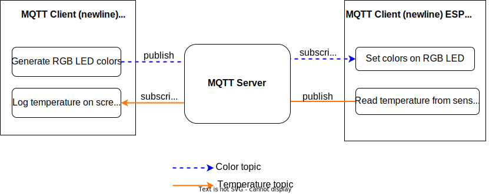

# MQTT Exercise: Sending Messages

## Setup

✅ Go to `intro/mqtt/exercise` directory.

✅ Open the prepared project skeleton in `intro/mqtt/exercise`.

✅ In `intro/mqtt/host_client` you can find a host run program that mimics the behavior of a second client. Run it in a separate terminal using the `cargo run` command. Find more information about the host client below.

The client also generates random RGB colors and publishes them in a topic.
**This is only relevant for the second part of this exercise**.

⚠️ Similar to the HTTP exercises, you need to configure your connection credentials in `cfg.toml` for **both programs**. Besides Wi-Fi credentials, you'll also need to add MQTT server details. Check each `cfg.toml.example` for required settings. Remember, the name between brackets in the `cfg.toml` file is the name of the package in `Cargo.toml`.

The structure of the exercises is as below. In this part, we will focus on the Temperature topic.



`intro/mqtt/exercise/solution/solution_publ.rs` contains a solution. You can run it with the following command:

```console
cargo run --example solution_publ
```

## Tasks

✅ Create an `EspMqttClient` with a default configuration and an empty handler closure.

✅ Send an empty message under the `hello_topic` to the broker. Use the `hello_topic(uuid)` utility function to generate a properly scoped topic.

✅ Verify a successful publish by having a client connected that logs these messages. The `host_client` implements this behavior. The `host_client` should be running in another terminal
before you run your program in the ESP Rust Board. `host_client` should print something like this:
```console
Setting new color: rgb(1,196,156)
Setting new color: rgb(182,190,128)
Board says hi!
```

✅ In the loop at the end of your main function, publish the board temperature on `temperature_data_topic(uuid)` every second. Verify this, using `host_client` too:
```console
Setting new color: rgb(218,157,124)
Board temperature: 33.29°C
Setting new color: rgb(45,88,22)
Board temperature: 33.32°C
```

## Establishing a Connection

Connections are managed by an instance of `esp_idf_svc::mqtt::client::EspMqttClient`.
It is constructed using
- a broker URL which in turn contains credentials, if necessary
- a configuration of the type `esp_idf_svc::mqtt::client::MqttClientConfiguration`
- a handler closure similar to the HTTP server exercise

```rust

let mut client = EspMqttClient::new(broker_url,
    &mqtt_config,
    move |message_event| {
        // ... your handler code here - leave this empty for now
        // we'll add functionality later in this chapter
    })?;

```

## Support Tools & Crates

To log the sensor values sent by the board, a helper client is provided under `intro/mqtt/host_client`. It subscribes to the temperature topic.

The `mqtt_messages` crate (located in `common/lib`) supports handling messages, subscriptions, and topics:

### Functions to Generate Topic Strings
-  `color_topic(uuid)` - creates a topic to send colors that will be published to the board.
<!-- - `cmd_topic_fragment(uuid)` - creates the leading part of a "command" topic (the `a-uuid/command/` part in `a-uuid/command/board_led`) -->
- `hello_topic(uuid)` - test topic for initially verifying a successful connection
- `temperature_data_topic(uuid)` - creates a whole "temperature" topic string


### Encoding and Decoding Message Payloads

The board temperature `f32` float is converted to four "big-endian" bytes using `temp.to_be_bytes()`.

```rust
// temperature
let temperature_data = &temp.to_be_bytes() as &[u8]; // board
let decoded_temperature = f32::from_be_bytes(temperature_data); // workstation
```

## Publish & Subscribe

`EspMqttClient` is also responsible for publishing messages under a given topic.
The `publish` function includes a `retain` parameter indicating whether this message should also be delivered to clients that connect after it has been published.

```rust
let publish_topic = /* ... */;
let payload: &[u8] = /* ... */ ;
client.publish(publish_topic, QoS::AtLeastOnce, false, payload)?;
```

## Troubleshooting

- `error: expected expression, found .` when building example client: update your stable Rust installation to 1.58 or newer
- MQTT messages not showing up? make sure all clients (board and workstation) use the same UUID (you can see it in the log output)
- Make sure the `cfg.toml` file is configured properly. The `example-client` has a `dbg!()` output at the start of the program, that shows `mqtt` configuration. It should output the content of your `cfg.toml` file.
- `error: expected expression, found .` while running the host-client can be solved with `rustup update`
