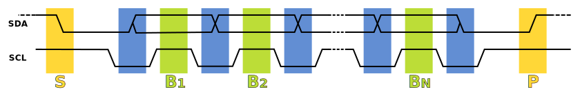

# I²C

## Introduction

The Inter-Integrated Circuit, usually shortened to I²C or I2C, is a serial protocol that allows multiple peripheral (or slave) chips to communicate with one or more controller (or master) chips. Many devices can be connected to the same I²C bus, and messages can be sent to a particular device by specifying its I²C address. The protocol requires two signal wires and can only be used for short-distance communications within one device.

One of the signal lines is for data (SDA) and the other is for the clock signal (SCL). The lines are pulled high by default, with some resistors fitted somewhere on the bus. Any device on the bus (or even multiple devices simultaneously) can 'pull' either or both of the signal lines low. This means that no damage occurs if two devices try to talk on the bus at the same time - the messages are merely corrupted (and this is detectable).

An I²C _transaction_ consists of one or more _messages_. Each _message_ consists of a _start symbol_, some _words_, and finally a _stop symbol_ (or another _start symbol_ if there is a follow-on message). Each word is eight bits, followed by an ACK (0) or NACK (1) bit which is sent by the recipient to indicate whether the word was received and understood correctly. The first word indicates both the 7-bit address of the device the message is intended for, plus a bit to indicate if the device is being _read from_ or being _written to_. If there is no device of that address on the bus, the first word will naturally have a NACK after it, because there is no device driving the SDA line low to generate an ACK bit, and so you know there is no device present.

The clock frequency of the SCL line is usually 400 kHz but slower and faster speeds are supported (standard speeds are 100 kHz-400 kHz-1 MHz).In our exercise, the configuration will be 400 kHz (` <MasterConfig as Default>::default().baudrate(400.kHz().into())`).

To read three bytes from an EEPROM device, the sequence will be something like:

| Step | Controller Sends         | Peripheral Sends                  |
| ---- | ------------------------ | --------------------------------- |
| 1.   | START                    |                                   |
| 2.   | Device Address + W       |                                   |
| 3.   |                          | ACK                               |
| 4.   | High EEPROM Address byte |                                   |
| 5.   |                          | ACK                               |
| 6.   | Low EEPROM Address byte  |                                   |
| 7.   |                          | ACK                               |
| 8.   | START                    |                                   |
| 9.   | Device Address + R       |                                   |
| 10.  |                          | ACK                               |
| 11.  |                          | Data Byte from EEPROM Address     |
| 12.  | ACK                      |                                   |
| 13.  |                          | Data Byte from EEPROM Address + 1 |
| 14.  | ACK                      |                                   |
| 15.  |                          | Data Byte from EEPROM Address + 2 |
| 16.  | NAK (i.e. end-of-read)   |                                   |
| 17.  | STOP                     |                                   |

### I²C Signal Image

A sequence diagram of data transfer on the I²C bus:
- S - Start condition
- P - Stop condition
- B1 to BN - Transferring of one bit
- SDA changes are allowed when SCL is low (blue), otherwise, there will be a start or stop condition generated.

[Source & more details: Wikipedia](https://en.wikipedia.org/wiki/I%C2%B2C).
